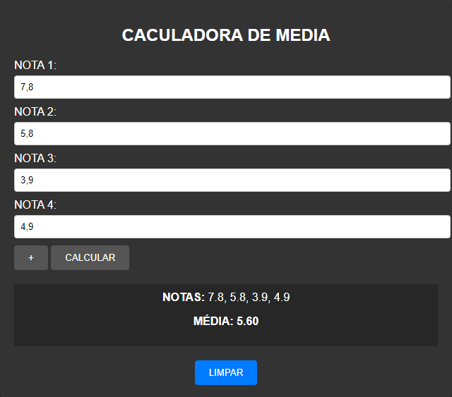

# CALCULADORA DE MEDIA
🆎CALCULADORA DE MEDIA EM HTML, CSS E JS.

  

## DESCRIÇÃO:
A "Calculadora de Média" é uma aplicação que permite calcular a média de um conjunto de notas fornecidas pelo usuário. Abaixo estão os principais recursos implementados:

1. Adicionar Notas:
   - O usuário pode adicionar até quatro notas, inserindo valores entre 0 e 10 nos campos de entrada.

2. Calcular Média:
   - Após inserir as notas desejadas, o usuário pode clicar no botão "CALCULAR" para calcular a média das notas fornecidas.

3. Visualizar Resultado:
   - O sistema exibirá as notas fornecidas e a média calculada na área designada abaixo dos campos de entrada.

4. Limpar Campos:
   - Se desejar recomeçar o processo, o usuário pode clicar no botão "LIMPAR" para limpar as notas e recomeçar o cálculo.

## EXECUTANDO O PROJETO:
1. Adicionar Notas:
   - Insira os valores das notas nos campos "NOTA 1", "NOTA 2" e assim por diante, conforme necessário.

2. Calcular Média:
   - Após inserir as notas, clique no botão "CALCULAR" para calcular a média.

3. Visualizar Resultado:
   - O sistema exibirá as notas inseridas e a média calculada na área abaixo dos campos de entrada.

4. Limpar Campos:
   - Se desejar recomeçar o processo, clique no botão "LIMPAR" para limpar os campos e começar novamente.

## NÃO SABE?
- Entendemos que para manipular arquivos em `HTML`, `CSS` e outras linguagens relacionadas, é necessário possuir conhecimento nessas áreas. Para auxiliar nesse aprendizado, oferecemos cursos gratuitos disponíveis:
* [CURSO DE HTML E CSS](https://github.com/VILHALVA/CURSO-DE-HTML-E-CSS)
* [CURSO DE JAVASCRIPT](https://github.com/VILHALVA/CURSO-DE-JAVASCRIPT)
* [CONFIRA MAIS CURSOS](https://github.com/VILHALVA?tab=repositories&q=+topic:CURSO)

## CREDITOS:
- [PROJETO CRIADO PELO VILHALVA](https://github.com/VILHALVA)

